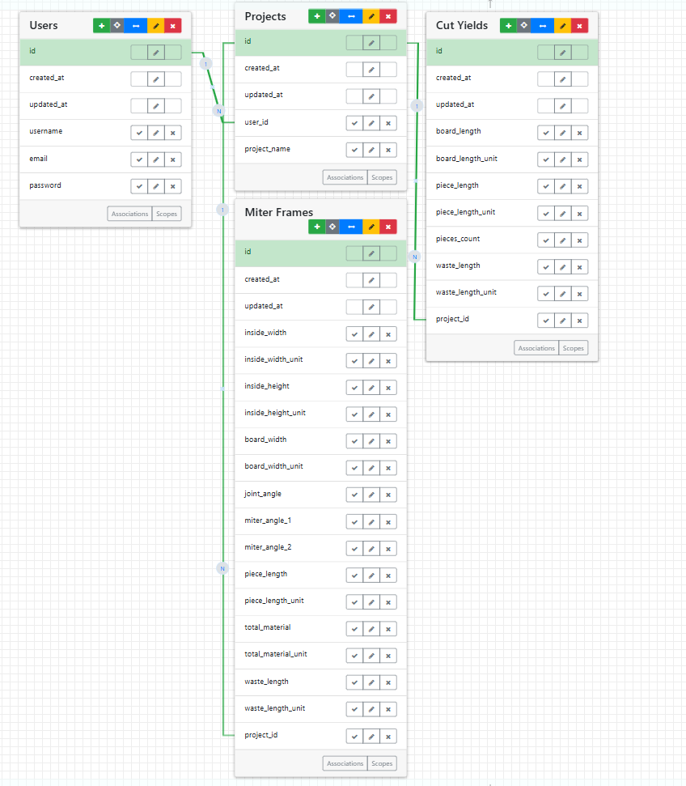

# Plank Pro

PlankPro is a Ruby on Rails application designed to help woodworkers, DIYers, and builders track cut yields, create frames (e.g., rectangles, triangles), calculate precise inside/outside measurements, and calculate cut angles. 

---

## Features

- **Cut Yields**
  - Define board lengths, piece lengths, and quantities
  - Automatically calculate waste and efficiency

- **Miter Frames**
  - Supports multiple shapes (rectangle, triangle, pentagon, hexagon, etc.)
  - Calculates inside length, outside length, board width, and miter angles
  - Displays measurements in inches with fractional precision

- **Clean UI**
  - Built with Rails views and custom CSS

### Setup
```
# Landing Page
Sign-up/sign-in to get to landing page

# Start the Server
bin/server

# Clone Repo 
https://github.com/Mrammoss/PlankPro.git

# Project Board
https://github.com/users/Mrammoss/projects/1/views/1

```

